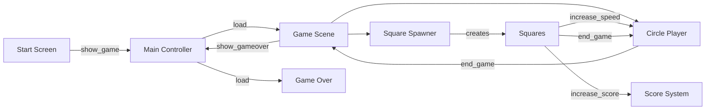
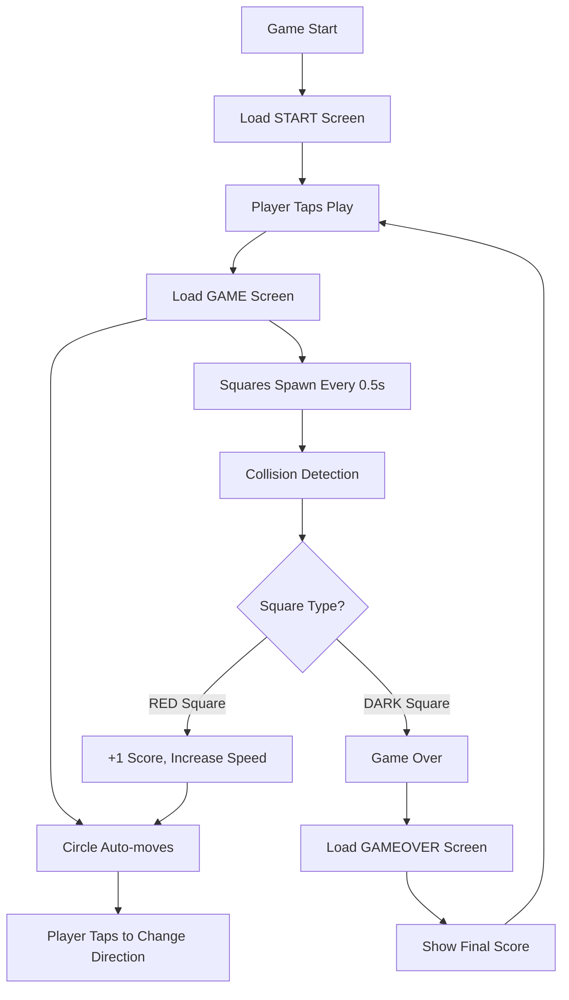

#CASUAL MOBILE GAME

# Mobile Square Game

## 🎮 Gameplay
[Your gameplay description]

## 📡 Message Communication Architecture

This diagram shows how all game components communicate using Defold's `msg.post()` system:



### Key Message Types

| Message | Sender | Receiver | Purpose |
|---------|--------|----------|---------|
| `show_game` | start.gui_script | main.script | Start game |
| `increase_score` | square.script | score.script | +1 point |
| `increase_speed` | square.script | circle.script, square_spawner.script | Increase difficulty |
| `end_game` | square.script / circle.script | container.script | Trigger game over |
| `show_gameover` | container.script | main.script | Load gameover screen |


# Mobile Square Game

A casual mobile dodge game built with Defold Engine where players control a bouncing circle to collect points while avoiding obstacles.

## 🎮 Gameplay

- Control a red circle that automatically moves left and right
- **Tap the screen** to change direction
- **Collect red squares** for points (+1 score)
- **Avoid dark squares** (instant game over)
- Game progressively gets faster as you score points
- Beat your high score!

## 🏗️ Project Structure

```
Mobile game/
├── main/                      # Core systems & entry point
│   ├── main.script           # State manager & scene loader
│   ├── main.collection       # Root scene with collection proxies
│   ├── data.lua              # Global game state & configuration
│   └── main.atlas            # Sprite assets
├── game/                      # Gameplay systems
│   ├── container.script      # Game orchestrator
│   ├── circle.script         # Player controller
│   ├── square_spawner.script # Obstacle spawner & factory
│   ├── square.script         # Individual obstacle behavior
│   ├── score.script          # Scoring & persistence
│   └── game.collection       # Gameplay scene
├── start/                     # Main menu
│   ├── start.gui_script      # Menu interaction logic
│   └── start.collection      # Menu scene
├── gameover/                  # Game over screen
│   ├── gameover.gui_script   # Results display
│   └── gameover.collection   # Results scene
└── custom/render/            # Rendering system
    └── custom.render_script  # Custom projection & screen adaptation
```

## 🔧 How It Works

### Game Architecture

The game uses a **state-based architecture** with three main states:

1. **START** - Main menu screen
2. **GAME** - Active gameplay
3. **GAMEOVER** - Results screen with final score

### Core Game Loop



### Key Systems

#### 1. **State Manager** (`main/main.script`)
- Entry point of the application
- Manages collection proxies for scene loading/unloading
- Handles transitions between START → GAME → GAMEOVER states

#### 2. **Player Controller** (`game/circle.script`)
- Handles circle movement between left/right boundaries
- Responds to touch input to reverse direction
- Speed increases with difficulty progression
- Triggers explosion particle effect on collision

**Key Properties:**
```lua
self.speed = 46              -- Starting speed
self.direction = 1 or 2      -- Left (1) or right (2)
```

#### 3. **Obstacle System** (`game/square_spawner.script`)
- Spawns falling squares using factory pattern
- Every 5th square is a collectible "point" square (red)
- Other squares are hazards (dark)
- Difficulty scales with score

**Spawn Logic:**
```lua
self.frequency = 22  -- Spawn interval
self.speed = 46      -- Fall speed
```

#### 4. **Obstacle Behavior** (`game/square.script`)
- Individual square logic
- Collision detection with circle
- Point squares: trigger score increase + speed boost
- Hazard squares: trigger game over

#### 5. **Scoring System** (`game/score.script`)
- Tracks current score during gameplay
- Animates score label on point collection (scale pulse)
- Saves best score to persistent storage

#### 6. **Global Configuration** (`main/data.lua`)
- Stores game state and constants
- Color definitions
- Save/load system for high scores
- Utility functions for distance and duration calculations

**Global State:**
```lua
M.STATE_START = 1
M.STATE_GAME = 2
M.STATE_GAMEOVER = 3

M.color_one = vmath.vector4(233/255, 70/255, 75/255, 1)   -- Red
M.color_two = vmath.vector4(53/255, 53/255, 65/255, 1)    -- Dark
M.bg_color = vmath.vector4(238/255, 238/255, 238/255, 1)  -- Light gray
```

### Message Communication Flow

The game uses Defold's message passing system for decoupled communication:

```
Player Taps Screen
    ↓
circle.script → msg.post('main:/sound#move', 'play_sound')
    ↓
Square Collision Detected
    ↓
square.script → msg.post('score', 'increase_score')
    ↓
square.script → msg.post('circle', 'increase_speed')
    ↓
score.script → Updates display & saves best score
```

### Difficulty Progression

Every time a red square is collected:

| System | Speed Increase | Max Value |
|--------|---------------|-----------|
| Circle | +0.45 pixels/unit | Unlimited |
| Square Fall Speed | +0.54 | 66 |
| Square Spawn Rate | +0.55 | 44 |

This creates an **accelerating difficulty curve** that challenges players progressively.

## 🎨 Technical Features

### Physics System
- **Trigger-based collision detection** (no physical response)
- Circle: Sphere collider, radius 26.0
- Squares: Box collider, 24x24x24
- Collision groups: "circle" ↔ "square"

### Rendering System (`custom/render/custom.render_script`)
- **Fixed-fit projection** maintains aspect ratio across devices
- Calculates screen boundaries for different device sizes
- Ensures consistent gameplay on all mobile screens

### Input Handling
- Single touch input mapped to `"touch"` action
- Processed by `circle.script` for direction changes
- Button interactions handled by GUI scripts

### Asset Management
- **Sounds:** 6 embedded audio files (button, explode, move, point, new_best, rebound)
- **Sprites:** Main atlas with game graphics
- **Font:** Custom Schlub.font for UI text
- **Particles:** Explosion effect for game over animation

## 🚀 Running the Project

1. Open the project in [Defold Editor](https://defold.com/)
2. Press **Project → Build** to compile
3. Press **Project → Run** or use **Ctrl+B** (Windows) / **Cmd+B** (Mac)
4. For mobile deployment:
   - **Project → Bundle → iOS** or **Android**
   - Configure signing and provisioning profiles

## 📱 Configuration

**Display Settings** (`game.project`):
- Resolution: 640×1136 (mobile vertical)
- Physics gravity: Y = -1000.0
- Physics scale: 0.01

**Input Bindings** (`input/game.input_binding`):
- Mouse button 1 → "touch" action

## 🎯 Code Design Patterns

1. **Collection Proxies** - Scene management with loadable/unloadable collections
2. **Message Passing** - Decoupled system communication via `msg.post()`
3. **Factory Pattern** - Dynamic square spawning at runtime
4. **State Machine** - Three distinct game states
5. **Timer System** - Delayed callbacks for spawning and animations

## 📝 Key Files Reference

| File | Purpose |
|------|---------|
| `main/main.script` | Entry point, state management, scene loading |
| `main/data.lua` | Global configuration, save system, utilities |
| `game/container.script` | Game scene orchestrator, start/stop logic |
| `game/circle.script` | Player movement and input handling |
| `game/square_spawner.script` | Obstacle factory and spawning logic |
| `game/square.script` | Individual obstacle behavior and collision |
| `game/score.script` | Score tracking and persistence |
| `custom/render/custom.render_script` | Screen projection and rendering pipeline |
<br><br>

