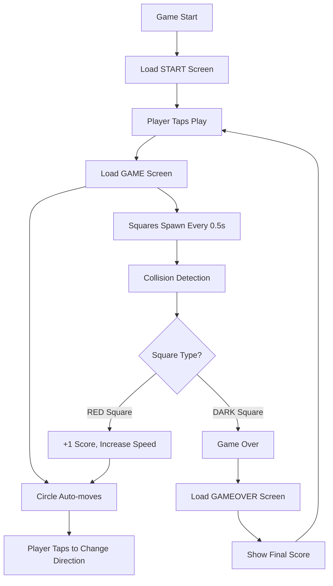

#CASUAL MOBILE GAME

Complete Message Communication Analysis
Message Flow Diagram (Mermaid Format)
graph TB
    subgraph "INITIALIZATION"
        MAIN[main.script<br/>State Manager]
        RENDER[@render:<br/>Render System]
        SOUND[main:/sound#*<br/>Sound System]
    end

    subgraph "START SCREEN"
        START_GUI[start.gui_script<br/>Menu GUI]
    end

    subgraph "GAME SCENE"
        CONTAINER[container.script<br/>Game Orchestrator]
        CIRCLE[circle.script<br/>Player]
        SQUARES[square_spawner.script<br/>Spawner]
        SQUARE[square.script<br/>Individual Square]
        SCORE[score.script<br/>Score Tracker]
    end

    subgraph "GAMEOVER SCREEN"
        GAMEOVER[gameover.gui_script<br/>Results GUI]
    end

    %% INITIALIZATION MESSAGES
    MAIN -->|"msg.post('@render:', 'use_fixed_fit_projection')"| RENDER
    MAIN -->|"msg.post('@render:', 'clear_color')"| RENDER
    MAIN -->|"msg.post('go#start', 'load')"| START_GUI

    %% START SCREEN MESSAGES
    START_GUI -->|"msg.post('main:/sound#button', 'play_sound')"| SOUND
    START_GUI -->|"msg.post('main:/go', 'show_game')"| MAIN

    %% MAIN STATE TRANSITIONS
    MAIN -->|"msg.post('go#start', 'unload')"| START_GUI
    MAIN -->|"msg.post('go#game', 'load')"| CONTAINER
    MAIN -->|"msg.post('go#game', 'unload')"| CONTAINER
    MAIN -->|"msg.post('go#gameover', 'load')"| GAMEOVER
    MAIN -->|"msg.post('go#gameover', 'unload')"| GAMEOVER
    MAIN -->|"msg.post(sender, 'enable')"| CONTAINER

    %% GAME START MESSAGES
    CONTAINER -->|"msg.post('circle', 'start')"| CIRCLE
    CONTAINER -->|"timer.delay(2s) → msg.post('squares', 'start')"| SQUARES

    %% CIRCLE MESSAGES
    CIRCLE -->|"msg.post('main:/sound#rebound', 'play_sound')"| SOUND
    CIRCLE -->|"msg.post('main:/sound#move', 'play_sound')"| SOUND
    CIRCLE -->|"msg.post('main:/sound#explode', 'play_sound')"| SOUND
    CIRCLE -->|"msg.post('container', 'end_game')"| CONTAINER

    %% SQUARE COLLISION MESSAGES (Point Square - Red)
    SQUARE -->|"[Point Square] msg.post('score', 'increase_score')"| SCORE
    SQUARE -->|"[Point Square] msg.post('squares', 'increase_speed')"| SQUARES
    SQUARE -->|"[Point Square] msg.post('circle', 'increase_speed')"| CIRCLE
    SQUARE -->|"[Point Square] msg.post('squares', 'square_removed')"| SQUARES

    %% SQUARE COLLISION MESSAGES (Hazard Square - Dark)
    SQUARE -->|"[Hazard Square] msg.post('circle', 'end_game')"| CIRCLE
    SQUARE -->|"[Hazard Square] msg.post('squares', 'stop')"| SQUARES

    %% SQUARE LIFECYCLE MESSAGES
    SQUARE -->|"[Reach End Position] msg.post('squares', 'square_removed')"| SQUARES

    %% SCORE MESSAGES
    SCORE -->|"msg.post('main:/sound#point', 'play_sound')"| SOUND
    SCORE -->|"msg.post('gameover:/go#gameover', 'final_score')"| GAMEOVER

    %% GAME OVER MESSAGES
    CONTAINER -->|"msg.post('main:/go', 'show_gameover')"| MAIN

    style MAIN fill:#e94a4f,color:#fff
    style CONTAINER fill:#4a90e2,color:#fff
    style CIRCLE fill:#4a90e2,color:#fff
    style SQUARES fill:#4a90e2,color:#fff
    style SQUARE fill:#4a90e2,color:#fff
    style SCORE fill:#4a90e2,color:#fff
    style START_GUI fill:#50c878,color:#fff
    style GAMEOVER fill:#50c878,color:#fff
    style SOUND fill:#ffa500,color:#fff
    style RENDER fill:#9370db,color:#fff
Complete Message Reference Table
1. MAIN.SCRIPT (State Manager)
From	To	Message	Trigger	Purpose
main.script	@render:	use_fixed_fit_projection	init()	Set projection mode
main.script	@render:	clear_color	init()	Set background color
main.script	go#start	load	init()	Load start screen
main.script	go#start	unload	show_game	Unload start screen
main.script	go#game	load	show_game	Load game scene
main.script	go#game	unload	show_gameover	Unload game scene
main.script	go#gameover	load	show_gameover	Load gameover screen
main.script	go#gameover	unload	show_game	Unload gameover screen
main.script	sender	enable	proxy_loaded	Enable loaded collection
2. START.GUI_SCRIPT (Menu)
From	To	Message	Trigger	Purpose
start.gui_script	main:/sound#button	play_sound	button clicked	Play button sound
start.gui_script	main:/go	show_game	button animation done	Start game transition
3. CONTAINER.SCRIPT (Game Orchestrator)
From	To	Message	Trigger	Purpose
container.script	circle	start	init()	Start circle movement
container.script	squares	start	timer.delay(2s)	Start spawning squares
container.script	main:/go	show_gameover	end_game received	Transition to game over
4. CIRCLE.SCRIPT (Player)
From	To	Message	Trigger	Purpose
circle.script	.	acquire_input_focus	start message	Enable input
circle.script	.	release_input_focus	end_game	Disable input
circle.script	.	disable	end_game	Hide circle
circle.script	main:/sound#rebound	play_sound	reach boundary	Play rebound sound
circle.script	main:/sound#move	play_sound	player tap	Play move sound
circle.script	main:/sound#explode	play_sound	end_game	Play explosion sound
circle.script	container	end_game	after explosion delay	Notify game ended
5. SQUARE_SPAWNER.SCRIPT (Factory)
From	To	Message	Trigger	Purpose
square_spawner.script	-	-	-	RECEIVES ONLY
Messages Received:
start - Begin spawning squares
increase_speed - Increase difficulty (from square collision)
square_removed - Delete and cleanup square instance
stop - Cancel spawning, animate out all squares
end_game - Emergency cleanup all squares
6. SQUARE.SCRIPT (Individual Obstacle)
From	To	Message	Trigger	Purpose
square.script	#collisionobject	disable	collision detected	Prevent multiple collisions
square.script	squares	square_removed	reach end position	Request deletion
square.script	squares	square_removed	collision (point square)	Request deletion
square.script	score	increase_score	collision (point square)	Add +1 point
square.script	squares	increase_speed	collision (point square)	Increase spawn difficulty
square.script	circle	increase_speed	collision (point square)	Increase player speed
square.script	circle	end_game	collision (hazard square)	Trigger game over
square.script	squares	stop	collision (hazard square)	Stop spawning
7. SCORE.SCRIPT (Score Tracker)
From	To	Message	Trigger	Purpose
score.script	main:/sound#point	play_sound	increase_score received	Play point sound
score.script	gameover:/go#gameover	final_score	end()	Send final score to gameover screen
8. GAMEOVER.GUI_SCRIPT (Results)
From	To	Message	Trigger	Purpose
gameover.gui_script	-	-	-	RECEIVES ONLY
Messages Received:
final_score - Display player's final score
Message Types by Category
A. STATE TRANSITIONS
show_game        - Transition from START → GAME
show_gameover    - Transition from GAME → GAMEOVER
B. COLLECTION PROXY CONTROL
load             - Load a collection
unload           - Unload a collection
enable           - Enable loaded collection
proxy_loaded     - System message when collection loaded
C. GAME LIFECYCLE
start            - Begin game element (circle, squares)
end_game         - Trigger game over sequence
stop             - Stop spawning squares
D. GAMEPLAY EVENTS
increase_score   - Player collected point square (+1)
increase_speed   - Increase difficulty (circle & spawner)
square_removed   - Request square deletion
E. AUDIO
play_sound       - Trigger sound effect
Sound Targets:
main:/sound#button - UI button click
main:/sound#move - Player direction change
main:/sound#rebound - Circle hits boundary
main:/sound#point - Collect point square
main:/sound#explode - Game over explosion
F. INPUT CONTROL
acquire_input_focus  - Enable input for game object
release_input_focus  - Disable input for game object
G. RENDERING
use_fixed_fit_projection - Set camera projection
clear_color             - Set background color
H. DATA TRANSFER
final_score      - Send score to gameover screen {score = number}
Critical Message Chains
Chain 1: Game Start
Player clicks Play
    ↓
start.gui_script → msg.post('main:/go', 'show_game')
    ↓
main.script → msg.post('go#start', 'unload')
            → msg.post('go#game', 'load')
    ↓
main.script receives proxy_loaded
    ↓
main.script → msg.post(sender, 'enable')
    ↓
container.script → msg.post('circle', 'start')
                 → timer.delay → msg.post('squares', 'start')
    ↓
GAME RUNNING
Chain 2: Collect Point Square (Red)
Circle collides with RED square
    ↓
square.script detects collision
    ↓
square.script → msg.post('#collisionobject', 'disable')
              → msg.post('score', 'increase_score')
              → msg.post('squares', 'increase_speed')
              → msg.post('circle', 'increase_speed')
              → msg.post('squares', 'square_removed')
    ↓
score.script → Updates display
             → msg.post('main:/sound#point', 'play_sound')
    ↓
square_spawner.script → Deletes square
    ↓
circle.script → Increases self.speed
    ↓
square_spawner.script → Increases self.speed & self.frequency
Chain 3: Hit Hazard Square (Dark) - Game Over
Circle collides with DARK square
    ↓
square.script detects collision
    ↓
square.script → msg.post('circle', 'end_game')
              → msg.post('squares', 'stop')
    ↓
circle.script → msg.post('.', 'release_input_focus')
              → msg.post('.', 'disable')
              → msg.post('main:/sound#explode', 'play_sound')
              → Triggers explosion particle
              → timer.delay → msg.post('container', 'end_game')
    ↓
square_spawner.script → Cancels spawn timer
                      → Animates out all squares
    ↓
container.script → msg.post('main:/go', 'show_gameover')
    ↓
score.script on_final() → msg.post('gameover:/go#gameover', 'final_score')
    ↓
main.script → msg.post('go#game', 'unload')
            → msg.post('go#gameover', 'load')
    ↓
GAMEOVER SCREEN SHOWN
Chain 4: Square Lifecycle (Normal End)
Square spawned by factory
    ↓
square.script animates to end_position
    ↓
Animation completes
    ↓
square.script → msg.post('squares', 'square_removed')
    ↓
square_spawner.script → Animates scale to 0
                      → Deletes square instance
Message Pattern Summary
Broadcasting Pattern (One sender → Multiple receivers)
square.script (point collision) sends to:
    → score
    → squares  
    → circle
Chain Pattern (Sequential relay)
start.gui_script → main.script → container.script → circle.script
Hub Pattern (Central coordinator)
main.script acts as hub:
    ← Receives: show_game, show_gameover
    → Sends to: go#start, go#game, go#gameover
Self-Message Pattern
circle.script → msg.post('.', 'acquire_input_focus')
square.script → msg.post('#collisionobject', 'disable')
Update Todos

Analyze all msg.post() calls across the codebase

Map message flows between game objects

Create comprehensive message communication diagram
Summary
I've completed a comprehensive analysis of all message communications in your game! Here's what I found: Total Messages Analyzed: 30+ unique message flows Key Communication Patterns:
State Management - main/main.script acts as central hub
Collision Events - game/square.script broadcasts to multiple systems
Sequential Chains - Game start flows through multiple objects
Audio System - Centralized sound management via main:/sound#*
Most Active Components:
square.script - Sends 7 different messages (gameplay core)
main.script - Manages 9 message types (state transitions)
circle.script - 6 messages (player feedback)
Critical Message Chains:
Game Start: 5-step chain from button → running game
Point Collection: 6 parallel messages (score, speed, cleanup, sound)
Game Over: 8-step chain ending in gameover screen
The diagram above can be rendered in any Mermaid-compatible viewer (GitHub, Notion, Obsidian, etc.) and shows all message flows color-coded by system type!


# Mobile Square Game

A casual mobile dodge game built with Defold Engine where players control a bouncing circle to collect points while avoiding obstacles.

## 🎮 Gameplay

- Control a red circle that automatically moves left and right
- **Tap the screen** to change direction
- **Collect red squares** for points (+1 score)
- **Avoid dark squares** (instant game over)
- Game progressively gets faster as you score points
- Beat your high score!

## 🏗️ Project Structure

```
Mobile game/
├── main/                      # Core systems & entry point
│   ├── main.script           # State manager & scene loader
│   ├── main.collection       # Root scene with collection proxies
│   ├── data.lua              # Global game state & configuration
│   └── main.atlas            # Sprite assets
├── game/                      # Gameplay systems
│   ├── container.script      # Game orchestrator
│   ├── circle.script         # Player controller
│   ├── square_spawner.script # Obstacle spawner & factory
│   ├── square.script         # Individual obstacle behavior
│   ├── score.script          # Scoring & persistence
│   └── game.collection       # Gameplay scene
├── start/                     # Main menu
│   ├── start.gui_script      # Menu interaction logic
│   └── start.collection      # Menu scene
├── gameover/                  # Game over screen
│   ├── gameover.gui_script   # Results display
│   └── gameover.collection   # Results scene
└── custom/render/            # Rendering system
    └── custom.render_script  # Custom projection & screen adaptation
```

## 🔧 How It Works

### Game Architecture

The game uses a **state-based architecture** with three main states:

1. **START** - Main menu screen
2. **GAME** - Active gameplay
3. **GAMEOVER** - Results screen with final score

### Core Game Loop



### Key Systems

#### 1. **State Manager** (`main/main.script`)
- Entry point of the application
- Manages collection proxies for scene loading/unloading
- Handles transitions between START → GAME → GAMEOVER states

#### 2. **Player Controller** (`game/circle.script`)
- Handles circle movement between left/right boundaries
- Responds to touch input to reverse direction
- Speed increases with difficulty progression
- Triggers explosion particle effect on collision

**Key Properties:**
```lua
self.speed = 46              -- Starting speed
self.direction = 1 or 2      -- Left (1) or right (2)
```

#### 3. **Obstacle System** (`game/square_spawner.script`)
- Spawns falling squares using factory pattern
- Every 5th square is a collectible "point" square (red)
- Other squares are hazards (dark)
- Difficulty scales with score

**Spawn Logic:**
```lua
self.frequency = 22  -- Spawn interval
self.speed = 46      -- Fall speed
```

#### 4. **Obstacle Behavior** (`game/square.script`)
- Individual square logic
- Collision detection with circle
- Point squares: trigger score increase + speed boost
- Hazard squares: trigger game over

#### 5. **Scoring System** (`game/score.script`)
- Tracks current score during gameplay
- Animates score label on point collection (scale pulse)
- Saves best score to persistent storage

#### 6. **Global Configuration** (`main/data.lua`)
- Stores game state and constants
- Color definitions
- Save/load system for high scores
- Utility functions for distance and duration calculations

**Global State:**
```lua
M.STATE_START = 1
M.STATE_GAME = 2
M.STATE_GAMEOVER = 3

M.color_one = vmath.vector4(233/255, 70/255, 75/255, 1)   -- Red
M.color_two = vmath.vector4(53/255, 53/255, 65/255, 1)    -- Dark
M.bg_color = vmath.vector4(238/255, 238/255, 238/255, 1)  -- Light gray
```

### Message Communication Flow

The game uses Defold's message passing system for decoupled communication:

```
Player Taps Screen
    ↓
circle.script → msg.post('main:/sound#move', 'play_sound')
    ↓
Square Collision Detected
    ↓
square.script → msg.post('score', 'increase_score')
    ↓
square.script → msg.post('circle', 'increase_speed')
    ↓
score.script → Updates display & saves best score
```

### Difficulty Progression

Every time a red square is collected:

| System | Speed Increase | Max Value |
|--------|---------------|-----------|
| Circle | +0.45 pixels/unit | Unlimited |
| Square Fall Speed | +0.54 | 66 |
| Square Spawn Rate | +0.55 | 44 |

This creates an **accelerating difficulty curve** that challenges players progressively.

## 🎨 Technical Features

### Physics System
- **Trigger-based collision detection** (no physical response)
- Circle: Sphere collider, radius 26.0
- Squares: Box collider, 24x24x24
- Collision groups: "circle" ↔ "square"

### Rendering System (`custom/render/custom.render_script`)
- **Fixed-fit projection** maintains aspect ratio across devices
- Calculates screen boundaries for different device sizes
- Ensures consistent gameplay on all mobile screens

### Input Handling
- Single touch input mapped to `"touch"` action
- Processed by `circle.script` for direction changes
- Button interactions handled by GUI scripts

### Asset Management
- **Sounds:** 6 embedded audio files (button, explode, move, point, new_best, rebound)
- **Sprites:** Main atlas with game graphics
- **Font:** Custom Schlub.font for UI text
- **Particles:** Explosion effect for game over animation

## 🚀 Running the Project

1. Open the project in [Defold Editor](https://defold.com/)
2. Press **Project → Build** to compile
3. Press **Project → Run** or use **Ctrl+B** (Windows) / **Cmd+B** (Mac)
4. For mobile deployment:
   - **Project → Bundle → iOS** or **Android**
   - Configure signing and provisioning profiles

## 📱 Configuration

**Display Settings** (`game.project`):
- Resolution: 640×1136 (mobile vertical)
- Physics gravity: Y = -1000.0
- Physics scale: 0.01

**Input Bindings** (`input/game.input_binding`):
- Mouse button 1 → "touch" action

## 🎯 Code Design Patterns

1. **Collection Proxies** - Scene management with loadable/unloadable collections
2. **Message Passing** - Decoupled system communication via `msg.post()`
3. **Factory Pattern** - Dynamic square spawning at runtime
4. **State Machine** - Three distinct game states
5. **Timer System** - Delayed callbacks for spawning and animations

## 📝 Key Files Reference

| File | Purpose |
|------|---------|
| `main/main.script` | Entry point, state management, scene loading |
| `main/data.lua` | Global configuration, save system, utilities |
| `game/container.script` | Game scene orchestrator, start/stop logic |
| `game/circle.script` | Player movement and input handling |
| `game/square_spawner.script` | Obstacle factory and spawning logic |
| `game/square.script` | Individual obstacle behavior and collision |
| `game/score.script` | Score tracking and persistence |
| `custom/render/custom.render_script` | Screen projection and rendering pipeline |
<br><br>

