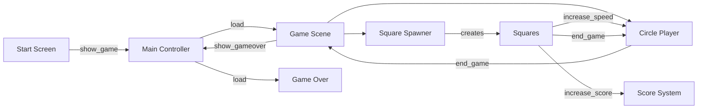
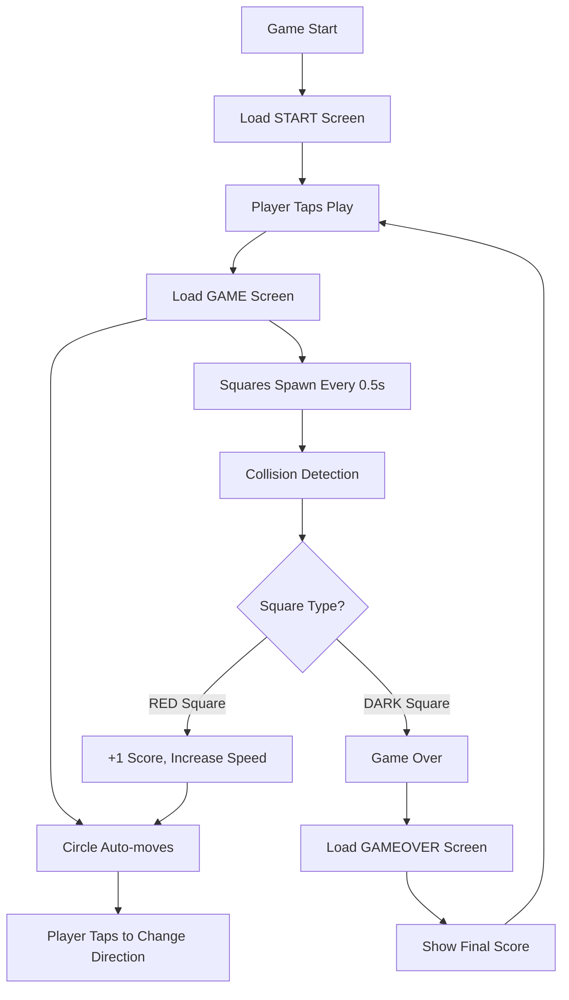

#CASUAL MOBILE GAME

# Mobile Square Game

## 🎮 Gameplay
at the begining <b>main.script</b> loading appropriate collection and unloading no needed one<br>


[Your gameplay description]

## 📡 Message Communication Architecture

This diagram shows how all game components communicate using Defold's `msg.post()` system:



### Key Message Types

| Message | Sender | Receiver | Purpose |
|---------|--------|----------|---------|
| `show_game` | start.gui_script | main.script | Start game |
| `increase_score` | square.script | score.script | +1 point |
| `increase_speed` | square.script | circle.script, square_spawner.script | Increase difficulty |
| `end_game` | square.script / circle.script | container.script | Trigger game over |
| `show_gameover` | container.script | main.script | Load gameover screen |


# Mobile Square Game

A casual mobile dodge game built with Defold Engine where players control a bouncing circle to collect points while avoiding obstacles.

## 🎮 Gameplay

- Control a red circle that automatically moves left and right
- **Tap the screen** to change direction
- **Collect red squares** for points (+1 score)
- **Avoid dark squares** (instant game over)
- Game progressively gets faster as you score points
- Beat your high score!

## 🏗️ Project Structure

```
Mobile game/
├── main/                      # Core systems & entry point
│   ├── main.script           # State manager & scene loader
│   ├── main.collection       # Root scene with collection proxies
│   ├── data.lua              # Global game state & configuration
│   └── main.atlas            # Sprite assets
├── game/                      # Gameplay systems
│   ├── container.script      # Game orchestrator
│   ├── circle.script         # Player controller
│   ├── square_spawner.script # Obstacle spawner & factory
│   ├── square.script         # Individual obstacle behavior
│   ├── score.script          # Scoring & persistence
│   └── game.collection       # Gameplay scene
├── start/                     # Main menu
│   ├── start.gui_script      # Menu interaction logic
│   └── start.collection      # Menu scene
├── gameover/                  # Game over screen
│   ├── gameover.gui_script   # Results display
│   └── gameover.collection   # Results scene
└── custom/render/            # Rendering system
    └── custom.render_script  # Custom projection & screen adaptation
```

## 🔧 How It Works

### Game Architecture

The game uses a **state-based architecture** with three main states:

1. **START** - Main menu screen
2. **GAME** - Active gameplay
3. **GAMEOVER** - Results screen with final score

### Core Game Loop



### Key Systems

#### 1. **State Manager** (`main/main.script`)
- Entry point of the application
- Manages collection proxies for scene loading/unloading
- Handles transitions between START → GAME → GAMEOVER states

#### 2. **Player Controller** (`game/circle.script`)
- Handles circle movement between left/right boundaries
- Responds to touch input to reverse direction
- Speed increases with difficulty progression
- Triggers explosion particle effect on collision

**Key Properties:**
```lua
self.speed = 46              -- Starting speed
self.direction = 1 or 2      -- Left (1) or right (2)
```

#### 3. **Obstacle System** (`game/square_spawner.script`)
- Spawns falling squares using factory pattern
- Every 5th square is a collectible "point" square (red)
- Other squares are hazards (dark)
- Difficulty scales with score

**Spawn Logic:**
```lua
self.frequency = 22  -- Spawn interval
self.speed = 46      -- Fall speed
```

#### 4. **Obstacle Behavior** (`game/square.script`)
- Individual square logic
- Collision detection with circle
- Point squares: trigger score increase + speed boost
- Hazard squares: trigger game over

#### 5. **Scoring System** (`game/score.script`)
- Tracks current score during gameplay
- Animates score label on point collection (scale pulse)
- Saves best score to persistent storage

#### 6. **Global Configuration** (`main/data.lua`)
- Stores game state and constants
- Color definitions
- Save/load system for high scores
- Utility functions for distance and duration calculations

**Global State:**
```lua
M.STATE_START = 1
M.STATE_GAME = 2
M.STATE_GAMEOVER = 3

M.color_one = vmath.vector4(233/255, 70/255, 75/255, 1)   -- Red
M.color_two = vmath.vector4(53/255, 53/255, 65/255, 1)    -- Dark
M.bg_color = vmath.vector4(238/255, 238/255, 238/255, 1)  -- Light gray
```

### Message Communication Flow

The game uses Defold's message passing system for decoupled communication:

```
Player Taps Screen
    ↓
circle.script → msg.post('main:/sound#move', 'play_sound')
    ↓
Square Collision Detected
    ↓
square.script → msg.post('score', 'increase_score')
    ↓
square.script → msg.post('circle', 'increase_speed')
    ↓
score.script → Updates display & saves best score
```

### Difficulty Progression

Every time a red square is collected:

| System | Speed Increase | Max Value |
|--------|---------------|-----------|
| Circle | +0.45 pixels/unit | Unlimited |
| Square Fall Speed | +0.54 | 66 |
| Square Spawn Rate | +0.55 | 44 |

This creates an **accelerating difficulty curve** that challenges players progressively.

## 🎨 Technical Features

### Physics System
- **Trigger-based collision detection** (no physical response)
- Circle: Sphere collider, radius 26.0
- Squares: Box collider, 24x24x24
- Collision groups: "circle" ↔ "square"

### Rendering System (`custom/render/custom.render_script`)
- **Fixed-fit projection** maintains aspect ratio across devices
- Calculates screen boundaries for different device sizes
- Ensures consistent gameplay on all mobile screens

### Input Handling
- Single touch input mapped to `"touch"` action
- Processed by `circle.script` for direction changes
- Button interactions handled by GUI scripts

### Asset Management
- **Sounds:** 6 embedded audio files (button, explode, move, point, new_best, rebound)
- **Sprites:** Main atlas with game graphics
- **Font:** Custom Schlub.font for UI text
- **Particles:** Explosion effect for game over animation

## 🚀 Running the Project

1. Open the project in [Defold Editor](https://defold.com/)
2. Press **Project → Build** to compile
3. Press **Project → Run** or use **Ctrl+B** (Windows) / **Cmd+B** (Mac)
4. For mobile deployment:
   - **Project → Bundle → iOS** or **Android**
   - Configure signing and provisioning profiles

## 📱 Configuration

**Display Settings** (`game.project`):
- Resolution: 640×1136 (mobile vertical)
- Physics gravity: Y = -1000.0
- Physics scale: 0.01

**Input Bindings** (`input/game.input_binding`):
- Mouse button 1 → "touch" action

## 🎯 Code Design Patterns

1. **Collection Proxies** - Scene management with loadable/unloadable collections
2. **Message Passing** - Decoupled system communication via `msg.post()`
3. **Factory Pattern** - Dynamic square spawning at runtime
4. **State Machine** - Three distinct game states
5. **Timer System** - Delayed callbacks for spawning and animations

## 📝 Key Files Reference

| File | Purpose |
|------|---------|
| `main/main.script` | Entry point, state management, scene loading |
| `main/data.lua` | Global configuration, save system, utilities |
| `game/container.script` | Game scene orchestrator, start/stop logic |
| `game/circle.script` | Player movement and input handling |
| `game/square_spawner.script` | Obstacle factory and spawning logic |
| `game/square.script` | Individual obstacle behavior and collision |
| `game/score.script` | Score tracking and persistence |
| `custom/render/custom.render_script` | Screen projection and rendering pipeline |
<br><br>


Game Scene - Complete Object Lifecycle & Message Flow
Game Scene Architecture Diagram
graph TB
    subgraph "GAME SCENE INITIALIZATION ORDER"
        PROXY[Collection Proxy: go#game]
        CONTAINER[1. container.script<br/>Game Orchestrator]
        CIRCLE[2. circle.script<br/>Player Object]
        SCORE[3. score.script<br/>Score Display]
        SQUARES[4. square_spawner.script<br/>Square Factory]
    end

    subgraph "DYNAMIC OBJECTS"
        SQUARE[square.script<br/>Individual Square Instance<br/>Created by Factory]
    end

    subgraph "EXTERNAL SYSTEMS"
        SOUND[Sound System<br/>main:/sound#*]
        MAIN[Main Controller<br/>main:/go]
    end

    PROXY -->|"proxy_loaded + enable"| CONTAINER
    CONTAINER -->|"init() → animate container in<br/>0.4s delay"| CONTAINER
    CONTAINER -->|"msg.post('circle', 'start')"| CIRCLE
    CONTAINER -->|"timer.delay(2s)<br/>msg.post('squares', 'start')"| SQUARES
    
    CIRCLE -->|"on 'start' received<br/>→ move()<br/>→ acquire_input_focus"| CIRCLE
    CIRCLE -->|"on tap<br/>msg.post('main:/sound#move', 'play_sound')"| SOUND
    CIRCLE -->|"on boundary reached<br/>msg.post('main:/sound#rebound', 'play_sound')"| SOUND
    CIRCLE -->|"on end_game<br/>msg.post('main:/sound#explode', 'play_sound')"| SOUND
    CIRCLE -->|"after explosion<br/>msg.post('container', 'end_game')"| CONTAINER
    
    SQUARES -->|"factory.create()<br/>every 0.5s"| SQUARE
    SQUARE -->|"init() → move()<br/>animate to end_position"| SQUARE
    SQUARE -->|"reach end position<br/>msg.post('squares', 'square_removed')"| SQUARES
    SQUARE -->|"collision: is_point=true<br/>msg.post('score', 'increase_score')"| SCORE
    SQUARE -->|"collision: is_point=true<br/>msg.post('squares', 'increase_speed')"| SQUARES
    SQUARE -->|"collision: is_point=true<br/>msg.post('circle', 'increase_speed')"| CIRCLE
    SQUARE -->|"collision: is_point=true<br/>msg.post('squares', 'square_removed')"| SQUARES
    SQUARE -->|"collision: is_point=false<br/>msg.post('circle', 'end_game')"| CIRCLE
    SQUARE -->|"collision: is_point=false<br/>msg.post('squares', 'stop')"| SQUARES
    
    SCORE -->|"on increase_score<br/>msg.post('main:/sound#point', 'play_sound')"| SOUND
    SCORE -->|"on final()<br/>msg.post('gameover:/go#gameover', 'final_score')"| MAIN
    
    CONTAINER -->|"on end_game<br/>timer.delay(0.3s) → animate out<br/>msg.post('main:/go', 'show_gameover')"| MAIN

    style CONTAINER fill:#e94a4f,color:#fff
    style CIRCLE fill:#4a90e2,color:#fff
    style SCORE fill:#50c878,color:#fff
    style SQUARES fill:#9370db,color:#fff
    style SQUARE fill:#ffa500,color:#fff
    style SOUND fill:#ff6b6b,color:#fff
    style MAIN fill:#4ecdc4,color:#fff
Detailed Initialization Sequence
sequenceDiagram
    autonumber
    participant Main as Main Controller
    participant Proxy as Collection Proxy
    participant Container as Container
    participant Circle as Circle (Player)
    participant Score as Score
    participant Spawner as Square Spawner
    participant Sound as Sound System

    Main->>Proxy: load collection
    Note over Proxy: Loading resources...
    Proxy->>Main: proxy_loaded
    Main->>Proxy: enable
    
    Note over Container: init() called
    Container->>Container: Set STATE_GAME
    Container->>Container: Position at bottom (y=-max_y)
    Container->>Container: Animate up (0.4s)
    
    Note over Circle: init() called
    Circle->>Circle: Set color, speed=46, random direction
    Circle->>Circle: Calculate boundaries (left/right)
    Circle->>Circle: Position at start boundary
    
    Note over Score: init() called
    Score->>Score: Set score=0, label color
    
    Note over Spawner: init() called
    Spawner->>Spawner: Set speed=46, frequency=22
    
    Note over Container: Animation complete (0.4s)
    Container->>Circle: msg.post('circle', 'start')
    
    Circle->>Circle: Call move()
    Circle->>Circle: Animate to opposite boundary
    Circle->>Circle: acquire_input_focus (enable touch)
    Note over Circle: Now bouncing left ↔ right
    
    Container->>Container: timer.delay(2s)
    Note over Container: Wait 2 seconds...
    
    Container->>Spawner: msg.post('squares', 'start')
    Note over Spawner: Start spawning squares
    Spawner->>Spawner: factory.create() first square
    
    Note over Container,Spawner: GAME FULLY ACTIVE
Complete Object Reference
1. CONTAINER.SCRIPT - Game Orchestrator
Initialization:
init():
    - Set data.state = STATE_GAME
    - Position container at bottom (y = -max_y)
    - Animate container up (0.4s duration)
    - On animation complete:
        ↓
        msg.post('circle', 'start')
        timer.delay(2s):
            msg.post('squares', 'start')
Messages Sent:
To	Message	When	Purpose
circle	start	After container animates in	Start player movement
squares	start	2 seconds after circle starts	Begin spawning squares
main:/go	show_gameover	After end_game animation	Transition to gameover screen
Messages Received:
From	Message	Action	Details
circle	end_game	Wait 0.3s → Animate container out → Notify main	Triggered after explosion completes
2. CIRCLE.SCRIPT - Player Controller
Initialization:
init():
    - Set sprite color (data.color_one = red)
    - Set line color (transparent black)
    - speed = 46
    - direction = random(1 or 2)  [1=left, 2=right]
    - Calculate boundaries:
        circle_max_left_x = line_edge_left + (circle_width/2)
        circle_max_right_x = line_edge_right - (circle_width/2)
    - Position at starting boundary
    - Wait for 'start' message
Messages Sent:
To	Message	When	Purpose
. (self)	acquire_input_focus	On start	Enable touch input
. (self)	release_input_focus	On end_game	Disable touch input
. (self)	disable	On end_game	Hide circle
main:/sound#move	play_sound	Player taps screen	Movement sound
main:/sound#rebound	play_sound	Reach boundary	Bounce sound
main:/sound#explode	play_sound	On end_game	Explosion sound
container	end_game	After explosion finishes	Notify game ended
Messages Received:
From	Message	Action	Details
container	start	Call move() + acquire input	Begin bouncing
square	increase_speed	speed += 0.45 (or +0.2 if speed > 56)	Max ~64
square	end_game	Release input → Disable → Play explosion → Notify container	Game over sequence
Input Handling:
on_input():
    if hash('touch') and action.pressed:
        → move()  (reverse direction)
        → msg.post('main:/sound#move', 'play_sound')
Core Logic - move():
move():
    1. Cancel current animation
    2. Calculate new_x (opposite boundary)
    3. Calculate duration based on speed & distance
    4. Animate to new_x
    5. On complete:
        → Call move() again (loop)
        → msg.post('main:/sound#rebound', 'play_sound')
    6. Flip direction (1 → 2 or 2 → 1)
3. SCORE.SCRIPT - Score Tracker
Initialization:
init():
    - score = 0
    - Set label color (black, 20% opacity)
Messages Sent:
To	Message	When	Purpose
main:/sound#point	play_sound	Score increases	Point collected sound
gameover:/go#gameover	final_score {score=N}	final() called	Send score to gameover screen
Messages Received:
From	Message	Action	Details
square	increase_score	score += 1 → Update label → Animate scale pulse (×1.15) → Play sound	Only from point squares
Core Logic:
on_message('increase_score'):
    1. self.score = self.score + 1
    2. label.set_text('#label', tostring(self.score))
    3. msg.post('main:/sound#point', 'play_sound')
    4. if not animating:
        → animate scale to 1.15x and back (0.28s)
4. SQUARE_SPAWNER.SCRIPT - Factory Manager
Initialization:
init():
    - speed = 46
    - frequency = 22
    - active = {}  (table of spawned squares)
    - square_counter = 0
    - Wait for 'start' message
Messages Sent:
To	Message	When	Purpose
None	-	-	Factory only creates objects, doesn't send messages
Messages Received:
From	Message	Action	Details
container	start	Call spawn() → Begin spawn loop	Starts spawning
square	increase_speed	speed += 0.54 (max 66)<br/>frequency += 0.55 (max 44)	Difficulty increase
square	square_removed {id=...}	Animate scale to 0 → Delete square	Normal cleanup
square	stop	Cancel timer → Animate out all squares	Stop spawning (game over)
circle	end_game	Cancel timers → Delete all squares immediately	Emergency cleanup
Core Logic - spawn():
spawn():
    1. Generate random start_x (0 to screen_width)
    2. start_position = (start_x, top_of_screen)
    3. Generate random end_x (within line boundaries)
    4. end_position = (end_x, mid_screen - 1/3 height)
    5. square_counter += 1
    6. Create square with factory:
        - speed = self.speed
        - end_position = calculated position
        - is_point = (square_counter % 5 == 0)  [Every 5th square is red]
    7. Add to active[] table
    8. Calculate delay for next spawn
    9. timer.delay(delay) → spawn() again
Spawn Frequency:
delay = duration(speed, start, end) / frequency
Higher frequency = faster spawning
Higher speed = faster falling
5. SQUARE.SCRIPT - Individual Obstacle
Properties (Set by Factory):
go.property('speed', 0)            -- Fall speed from spawner
go.property('end_position', vec3)  -- Target position
go.property('is_point', false)     -- true = red (collectible), false = dark (hazard)
Initialization:
init():
    if is_point:
        → Set color to data.color_one (red)
    else:
        → Set color to data.color_two (dark)
    → Call move()
Messages Sent:
To	Message	When	Purpose
#collisionobject	disable	Collision detected	Prevent multiple collisions
squares	square_removed {id=...}	Reach end OR collision (point)	Request deletion
score	increase_score	Collision (is_point=true)	Add +1 score
squares	increase_speed	Collision (is_point=true)	Increase spawn difficulty
circle	increase_speed	Collision (is_point=true)	Increase player speed
circle	end_game	Collision (is_point=false)	Trigger game over
squares	stop	Collision (is_point=false)	Stop spawning
Messages Received:
From	Message	Action	Details
Physics	trigger_response	Handle collision logic	See collision logic below
Core Logic - move():
move():
    1. Calculate duration (speed, current_pos, end_position)
    2. Pick random spin direction (360 or -360)
    3. Start rotation loop animation
    4. Animate position to end_position
    5. On complete:
        → msg.post('squares', 'square_removed', {id=...})
Collision Logic:
on_message('trigger_response'):
    if enter and other_group == 'circle' and not collided:
        collided = true  (prevent multiple triggers)
        msg.post('#collisionobject', 'disable')
        
        if is_point == true:  [RED SQUARE - COLLECT IT]
            ↓
            1. msg.post('score', 'increase_score')
            2. msg.post('squares', 'increase_speed')
            3. msg.post('circle', 'increase_speed')
            4. Animate scale to 0 (0.1s)
            5. msg.post('squares', 'square_removed', {id=...})
            
        else:  [DARK SQUARE - GAME OVER]
            ↓
            1. msg.post('circle', 'end_game')
            2. msg.post('squares', 'stop')
Critical Message Chains
Chain 1: Game Start (Full Initialization)
Main Controller loads game
    ↓
Collection Proxy: proxy_loaded
    ↓
Main sends: enable
    ↓
Container.init() executes:
    ├─ Set state = GAME
    ├─ Position at bottom
    └─ Animate up (0.4s)
        ↓
    Animation complete:
        ├─ msg.post('circle', 'start')
        │   ↓
        │   Circle receives 'start':
        │   ├─ move() → Animate to boundary
        │   └─ acquire_input_focus (enable touch)
        │       ↓
        │   Circle bouncing left ↔ right
        │
        └─ timer.delay(2s)
            ↓
            msg.post('squares', 'start')
                ↓
            Spawner receives 'start':
                ├─ spawn() first square
                └─ Start spawn timer loop
                    ↓
                GAME FULLY RUNNING
Timeline:
t=0.0s - Container animates in
t=0.4s - Circle starts moving
t=2.4s - Squares start spawning
Chain 2: Collect Point Square (Success Path)
Circle collides with RED square
    ↓
Square detects: trigger_response + is_point=true
    ↓
Square sends 4 parallel messages:
    │
    ├─→ msg.post('score', 'increase_score')
    │       ↓
    │   Score receives:
    │   ├─ score += 1
    │   ├─ Update label text
    │   ├─ Animate scale pulse (×1.15)
    │   └─ msg.post('main:/sound#point', 'play_sound')
    │           ↓
    │       Sound plays "point.wav"
    │
    ├─→ msg.post('squares', 'increase_speed')
    │       ↓
    │   Spawner receives:
    │   ├─ speed += 0.54 (max 66)
    │   └─ frequency += 0.55 (max 44)
    │       ↓
    │   Squares fall faster & spawn more frequently
    │
    ├─→ msg.post('circle', 'increase_speed')
    │       ↓
    │   Circle receives:
    │   └─ speed += 0.45 (max ~64)
    │       ↓
    │   Circle moves faster between boundaries
    │
    └─→ Animate scale to 0 (0.1s)
            ↓
        msg.post('squares', 'square_removed', {id=...})
            ↓
        Spawner receives:
        ├─ Find square in active[] table
        ├─ Remove from table
        ├─ Animate scale to 0 (0.3s)
        └─ go.delete(square)
            ↓
        Square cleaned up

RESULT: +1 Score, Difficulty Increased, Square Removed
Chain 3: Hit Hazard Square (Game Over Path)
Circle collides with DARK square
    ↓
Square detects: trigger_response + is_point=false
    ↓
Square sends 2 parallel messages:
    │
    ├─→ msg.post('circle', 'end_game')
    │       ↓
    │   Circle receives 'end_game':
    │   ├─ msg.post('.', 'release_input_focus')  [Disable touch]
    │   ├─ Cancel position animations
    │   ├─ msg.post('.', 'disable')  [Hide circle]
    │   ├─ particlefx.play('#explode')  [Start explosion]
    │   └─ msg.post('main:/sound#explode', 'play_sound')
    │       ↓
    │   Wait for explosion to finish (callback):
    │       ↓
    │   msg.post('container', 'end_game')
    │       ↓
    │   Container receives 'end_game':
    │   ├─ Set state = GAMEOVER
    │   ├─ timer.delay(0.3s)
    │   └─ Animate container down (0.4s)
    │       ↓
    │   Animation complete:
    │       ↓
    │   msg.post('main:/go', 'show_gameover')
    │       ↓
    │   Main Controller:
    │   ├─ msg.post('go#game', 'unload')
    │   └─ msg.post('go#gameover', 'load')
    │       ↓
    │   Score.final() executes:
    │       ↓
    │   msg.post('gameover:/go#gameover', 'final_score', {score=N})
    │       ↓
    │   GAMEOVER SCREEN SHOWN
    │
    └─→ msg.post('squares', 'stop')
            ↓
        Spawner receives 'stop':
        ├─ timer.cancel(spawn_timer)
        ├─ For each square in active[]:
        │   ├─ Cancel animations
        │   ├─ Animate scale to 0 (0.3s, 0.5s delay)
        │   └─ go.delete(square)
        └─ Clear active[] table
            ↓
        All squares removed

RESULT: Game Over Sequence, Transition to Gameover Screen
Chain 4: Square Lifecycle (Normal End - No Collision)
Spawner creates square via factory
    ↓
Square.init() executes:
    ├─ Set color (red or dark)
    └─ move()
        ├─ Animate rotation (loop)
        └─ Animate position to end_position
            ↓
        [Time passes... falling...]
            ↓
        Animation reaches end_position:
            ↓
        msg.post('squares', 'square_removed', {id=...})
            ↓
        Spawner receives 'square_removed':
        ├─ Find square in active[] table
        ├─ Remove from table
        ├─ Animate scale to 0 (0.3s)
        └─ go.delete(square)
            ↓
        Square cleaned up

RESULT: Square Removed (No Collision)
Object Interaction Matrix
Object	Sends To	Messages Sent
Container	Circle	start
Squares	start
Main	show_gameover
Circle	Self	acquire_input_focus, release_input_focus, disable
Sound	play_sound (move, rebound, explode)
Container	end_game
Square	Self	disable (collisionobject)
Score	increase_score
Squares	increase_speed, square_removed
Circle	increase_speed, end_game
Score	Sound	play_sound (point)
Gameover	final_score
Spawner	(None)	Creates objects via factory
State Machine - Game Scene Lifecycle
stateDiagram-v2
    [*] --> Loading: Collection loads
    Loading --> Initializing: All init() called
    Initializing --> AnimatingIn: Container slides up
    AnimatingIn --> CircleActive: Circle starts moving
    CircleActive --> GameRunning: Squares start spawning (2s delay)
    
    GameRunning --> CollectPoint: Player hits RED square
    CollectPoint --> GameRunning: Score +1, Speed increased
    
    GameRunning --> GameOver: Player hits DARK square
    GameOver --> ExplosionPlaying: Circle explodes
    ExplosionPlaying --> AnimatingOut: Container slides down
    AnimatingOut --> Unloading: Transition to gameover
    Unloading --> [*]
    
    note right of GameRunning
        Player taps to change direction
        Squares continuously spawn
        Difficulty increases with score
    end note
    
    note right of CollectPoint
        Parallel messages:
        - increase_score
        - increase_speed (×2)
        - square_removed
    end note
    
    note right of GameOver
        Parallel messages:
        - end_game (circle)
        - stop (spawner)
    end note
Update Todos

Analyze Game Scene initialization sequence

Map all messages within Game Scene objects

Document all action/reaction logic chains

Create detailed Game Scene flow diagram
Summary
I've created a complete Game Scene analysis with detailed diagrams showing:
What's Included:
Architecture Diagram - Visual overview of all objects and their connections
Initialization Sequence - Step-by-step timeline with exact timings
Complete Object Reference - All 5 objects with:
Initialization logic
Messages sent (to whom, when, why)
Messages received (from whom, action taken)
Core functions explained
4 Critical Message Chains:
Game Start (full initialization)
Collect Point Square (success path)
Hit Hazard Square (game over path)
Square Lifecycle (normal removal)
Object Interaction Matrix - Quick reference table
State Machine - Game lifecycle states
Key Insights:
Initialization Order: Container → Circle → Score → Spawner
Timing: Circle starts at 0.4s, Squares at 2.4s
Messages: 20+ unique message flows documented
Critical Path: Point collision sends 4 parallel messages
Game Over: 2-stage process (explosion → container animation)
All diagrams use Mermaid syntax and will render perfectly on GitHub! You can copy this entire markdown section directly to your README.md file.
