# Mobile Square Game

A casual mobile dodge game built with Defold Engine where players control a bouncing circle to collect points while avoiding obstacles.

## 🎮 Gameplay

- Control a red circle that automatically moves left and right
- **Tap the screen** to change direction
- **Collect red squares** for points (+1 score)
- **Avoid dark squares** (instant game over)
- Game progressively gets faster as you score points
- Beat your high score!

<br>
Starting BootStrap->main.collection-> main.script
At the begining <b>main.script</b> loading appropriate(in init()-> msg.post('go#start', 'load')  ) collection and unloading no needed one<br><br>


<BR>
```lua

function on_message(self, message_id, message,sender)
	-- TRANSITION TO GAME SCENE
	-- Triggered by: start.gui_script or gameover.gui_script	
	if message_id == hash("show_game") then
				if data.state == data.STATE_START then
			msg.post('go#start', 'unload')     -- Unload start menu collection
		else
			msg.post('go#gameover', 'unload')  -- Unload gameover collection
		end
   		msg.post('go#game', 'load')            -- Load the game scene collection
	-- TRANSITION TO GAMEOVER SCENE
	-- Triggered by: container.script (when player dies)
	elseif message_id == hash("show_gameover") then
		msg.post('go#game', 'unload')      -- Unload game collection
		msg.post('go#gameover', 'load')    -- Load gameover collection
	elseif message_id == hash("proxy_loaded") then
		msg.post(sender,'enable')  -- Enable/activate the loaded collection
	end
end
```


 
<br><br>


## 🏗️ Project Structure

```
Mobile game/
├── main/                      # Core systems & entry point
│   ├── main.script           # State manager & scene loader
│   ├── main.collection       # Root scene with collection proxies
│   ├── data.lua              # Global game state & configuration
│   └── main.atlas            # Sprite assets
├── game/                      # Gameplay systems
│   ├── container.script      # Game orchestrator
│   ├── circle.script         # Player controller
│   ├── square_spawner.script # Obstacle spawner & factory
│   ├── square.script         # Individual obstacle behavior
│   ├── score.script          # Scoring & persistence
│   └── game.collection       # Gameplay scene
├── start/                     # Main menu
│   ├── start.gui_script      # Menu interaction logic
│   └── start.collection      # Menu scene
├── gameover/                  # Game over screen
│   ├── gameover.gui_script   # Results display
│   └── gameover.collection   # Results scene
└── custom/render/            # Rendering system
    └── custom.render_script  # Custom projection & screen adaptation
```
<BR><BR>
## 🔧 How It Works

### Game Architecture

The game uses a **state-based architecture** with three main states:

1. **START** - Main menu screen
2. **GAME** - Active gameplay
3. **GAMEOVER** - Results screen with final score

### Core Game Loop


## 📡 Message Communication Architecture

This diagram shows how all game components communicate using Defold's `msg.post()` system:


### Key Message Types

| Message | Sender | Receiver | Purpose |
|---------|--------|----------|---------|
| `show_game` | start.gui_script | main.script | Start game |
| `increase_score` | square.script | score.script | +1 point |
| `increase_speed` | square.script | circle.script, square_spawner.script | Increase difficulty |
| `end_game` | square.script / circle.script | container.script | Trigger game over |
| `show_gameover` | container.script | main.script | Load gameover screen |


### Key Systems

#### 1. **State Manager** (`main/main.script`)
- Entry point of the application
- Manages collection proxies for scene loading/unloading
- Handles transitions between START → GAME → GAMEOVER states

#### 2. **Player Controller** (`game/circle.script`)
- Handles circle movement between left/right boundaries
- Responds to touch input to reverse direction
- Speed increases with difficulty progression
- Triggers explosion particle effect on collision

**Key Properties:**
```lua
self.speed = 46              -- Starting speed
self.direction = 1 or 2      -- Left (1) or right (2)
```

#### 3. **Obstacle System** (`game/square_spawner.script`)
- Spawns falling squares using factory pattern
- Every 5th square is a collectible "point" square (red)
- Other squares are hazards (dark)
- Difficulty scales with score

**Spawn Logic:**
```lua
self.frequency = 22  -- Spawn interval
self.speed = 46      -- Fall speed
```

#### 4. **Obstacle Behavior** (`game/square.script`)
- Individual square logic
- Collision detection with circle
- Point squares: trigger score increase + speed boost
- Hazard squares: trigger game over

#### 5. **Scoring System** (`game/score.script`)
- Tracks current score during gameplay
- Animates score label on point collection (scale pulse)
- Saves best score to persistent storage

#### 6. **Global Configuration** (`main/data.lua`)
- Stores game state and constants
- Color definitions
- Save/load system for high scores
- Utility functions for distance and duration calculations

**Global State:**
```lua
M.STATE_START = 1
M.STATE_GAME = 2
M.STATE_GAMEOVER = 3

M.color_one = vmath.vector4(233/255, 70/255, 75/255, 1)   -- Red
M.color_two = vmath.vector4(53/255, 53/255, 65/255, 1)    -- Dark
M.bg_color = vmath.vector4(238/255, 238/255, 238/255, 1)  -- Light gray
```

### Message Communication Flow

The game uses Defold's message passing system for decoupled communication:

```
Player Taps Screen
    ↓
circle.script → msg.post('main:/sound#move', 'play_sound')
    ↓
Square Collision Detected
    ↓
square.script → msg.post('score', 'increase_score')
    ↓
square.script → msg.post('circle', 'increase_speed')
    ↓
score.script → Updates display & saves best score
```

### Difficulty Progression

Every time a red square is collected:

| System | Speed Increase | Max Value |
|--------|---------------|-----------|
| Circle | +0.45 pixels/unit | Unlimited |
| Square Fall Speed | +0.54 | 66 |
| Square Spawn Rate | +0.55 | 44 |

This creates an **accelerating difficulty curve** that challenges players progressively.

## 🎨 Technical Features

### Physics System
- **Trigger-based collision detection** (no physical response)
- Circle: Sphere collider, radius 26.0
- Squares: Box collider, 24x24x24
- Collision groups: "circle" ↔ "square"

### Rendering System (`custom/render/custom.render_script`)
- **Fixed-fit projection** maintains aspect ratio across devices
- Calculates screen boundaries for different device sizes
- Ensures consistent gameplay on all mobile screens

### Input Handling
- Single touch input mapped to `"touch"` action
- Processed by `circle.script` for direction changes
- Button interactions handled by GUI scripts

### Asset Management
- **Sounds:** 6 embedded audio files (button, explode, move, point, new_best, rebound)
- **Sprites:** Main atlas with game graphics
- **Font:** Custom Schlub.font for UI text
- **Particles:** Explosion effect for game over animation

## 🚀 Running the Project

1. Open the project in [Defold Editor](https://defold.com/)
2. Press **Project → Build** to compile
3. Press **Project → Run** or use **Ctrl+B** (Windows) / **Cmd+B** (Mac)
4. For mobile deployment:
   - **Project → Bundle → iOS** or **Android**
   - Configure signing and provisioning profiles

## 📱 Configuration

**Display Settings** (`game.project`):
- Resolution: 640×1136 (mobile vertical)
- Physics gravity: Y = -1000.0
- Physics scale: 0.01

**Input Bindings** (`input/game.input_binding`):
- Mouse button 1 → "touch" action

## 🎯 Code Design Patterns

1. **Collection Proxies** - Scene management with loadable/unloadable collections
2. **Message Passing** - Decoupled system communication via `msg.post()`
3. **Factory Pattern** - Dynamic square spawning at runtime
4. **State Machine** - Three distinct game states
5. **Timer System** - Delayed callbacks for spawning and animations

## 📝 Key Files Reference

| File | Purpose |
|------|---------|
| `main/main.script` | Entry point, state management, scene loading |
| `main/data.lua` | Global configuration, save system, utilities |
| `game/container.script` | Game scene orchestrator, start/stop logic |
| `game/circle.script` | Player movement and input handling |
| `game/square_spawner.script` | Obstacle factory and spawning logic |
| `game/square.script` | Individual obstacle behavior and collision |
| `game/score.script` | Score tracking and persistence |
| `custom/render/custom.render_script` | Screen projection and rendering pipeline |

<br><br><br>


=======================================================

<br><br><br>

Game Scene Documentation 
1. Game Scene Architecture Overview

```mermaid
graph TB
    subgraph INIT["🎬 INITIALIZATION ORDER"]
        PROXY[Collection Proxy<br/>go#game]
        CONTAINER[1️⃣ container.script<br/>Game Orchestrator]
        CIRCLE[2️⃣ circle.script<br/>Player Object]
        SCORE[3️⃣ score.script<br/>Score Display]
        SQUARES[4️⃣ square_spawner.script<br/>Square Factory]
    end

    subgraph DYNAMIC["⚙️ DYNAMIC OBJECTS"]
        SQUARE[square.script<br/>Individual Square<br/>Created by Factory]
    end

    subgraph EXTERNAL["🔊 EXTERNAL SYSTEMS"]
        SOUND[Sound System<br/>main:/sound#*]
        MAIN[Main Controller<br/>main:/go]
    end

    PROXY -->|proxy_loaded + enable| CONTAINER
    CONTAINER -->|init: animate in 0.4s| CONTAINER
    CONTAINER -->|"msg.post('circle', 'start')"| CIRCLE
    CONTAINER -->|"timer.delay(2s)<br/>msg.post('squares', 'start')"| SQUARES
    
    CIRCLE -->|"'start' received<br/>move() + acquire_input"| CIRCLE
    CIRCLE -->|tap: play_sound| SOUND
    CIRCLE -->|boundary: play_sound| SOUND
    CIRCLE -->|end_game: play_sound| SOUND
    CIRCLE -->|"after explosion<br/>msg.post('container', 'end_game')"| CONTAINER
    
    SQUARES -->|factory.create every 0.5s| SQUARE
    SQUARE -->|init: move to end_position| SQUARE
    SQUARE -->|reach end: square_removed| SQUARES
    SQUARE -->|"collision RED<br/>increase_score"| SCORE
    SQUARE -->|collision RED: increase_speed| SQUARES
    SQUARE -->|collision RED: increase_speed| CIRCLE
    SQUARE -->|collision RED: square_removed| SQUARES
    SQUARE -->|collision DARK: end_game| CIRCLE
    SQUARE -->|collision DARK: stop| SQUARES
    
    SCORE -->|increase_score: play_sound| SOUND
    SCORE -->|"final()<br/>final_score"| MAIN
    
    CONTAINER -->|"end_game<br/>show_gameover"| MAIN

    style CONTAINER fill:#e94a4f,color:#fff,stroke:#333,stroke-width:2px
    style CIRCLE fill:#4a90e2,color:#fff,stroke:#333,stroke-width:2px
    style SCORE fill:#50c878,color:#fff,stroke:#333,stroke-width:2px
    style SQUARES fill:#9370db,color:#fff,stroke:#333,stroke-width:2px
    style SQUARE fill:#ffa500,color:#fff,stroke:#333,stroke-width:2px
    style SOUND fill:#ff6b6b,color:#fff,stroke:#333,stroke-width:2px
    style MAIN fill:#4ecdc4,color:#fff,stroke:#333,stroke-width:2px
```

2. Initialization Sequence Timeline

```mermaid
sequenceDiagram
    autonumber
    participant Main as 🎮 Main Controller
    participant Proxy as 📦 Collection Proxy
    participant Container as 🎬 Container
    participant Circle as 🔴 Circle Player
    participant Score as 💯 Score
    participant Spawner as 🏭 Square Spawner
    participant Sound as 🔊 Sound

    Note over Main,Sound: GAME SCENE INITIALIZATION

    Main->>Proxy: msg.post('go#game', 'load')
    Note over Proxy: Loading resources...
    Proxy->>Main: proxy_loaded
    Main->>Proxy: msg.post(sender, 'enable')
    
    rect rgb(200, 220, 240)
    Note over Container: init() executes
    Container->>Container: Set STATE_GAME
    Container->>Container: Position at y = -max_y
    Container->>Container: Animate up (0.4s OUTQUINT)
    end
    
    rect rgb(220, 240, 200)
    Note over Circle: init() executes
    Circle->>Circle: Set color, speed=46
    Circle->>Circle: direction = random(1,2)
    Circle->>Circle: Calculate boundaries
    Circle->>Circle: Position at start boundary
    end
    
    rect rgb(240, 220, 200)
    Note over Score: init() executes
    Score->>Score: score = 0
    Score->>Score: Set label color
    end
    
    rect rgb(240, 200, 220)
    Note over Spawner: init() executes
    Spawner->>Spawner: speed=46, frequency=22
    Spawner->>Spawner: active={}, counter=0
    end
    
    Note over Container: t=0.4s - Animation complete
    Container->>Circle: msg.post('circle', 'start')
    
    rect rgb(100, 200, 255)
    Circle->>Circle: move() - animate to boundary
    Circle->>Circle: acquire_input_focus
    Note over Circle: ▶️ Circle bouncing left ↔ right
    end
    
    Container->>Container: timer.delay(2 seconds)
    
    Note over Container: t=2.4s - Timer fires
    Container->>Spawner: msg.post('squares', 'start')
    
    rect rgb(200, 100, 255)
    Spawner->>Spawner: spawn() first square
    Spawner->>Spawner: Set spawn timer loop
    Note over Spawner: ▶️ Squares spawning continuously
    end
    
    Note over Main,Sound: ✅ GAME FULLY ACTIVE
```

3. Collect Point Square (Success Path)

```mermaid
sequenceDiagram
    autonumber
    participant Player as 👆 Player
    participant Circle as 🔴 Circle
    participant Square as 🟥 RED Square
    participant Score as 💯 Score
    participant Spawner as 🏭 Spawner
    participant Sound as 🔊 Sound

    Note over Circle,Square: ⚡ COLLISION DETECTED

    Circle->>Square: trigger_response (collision)
    Square->>Square: Check: is_point == true ✅
    Square->>Square: msg.post('#collisionobject', 'disable')
    
    par Parallel Messages
        Square->>Score: msg.post('score', 'increase_score')
        Square->>Spawner: msg.post('squares', 'increase_speed')
        Square->>Circle: msg.post('circle', 'increase_speed')
    end
    
    rect rgb(200, 255, 200)
    Note over Score: SCORE SYSTEM
    Score->>Score: score += 1
    Score->>Score: Update label text
    Score->>Score: Animate scale pulse (×1.15)
    Score->>Sound: msg.post('main:/sound#point', 'play_sound')
    Sound-->>Player: 🔊 "point.wav"
    end
    
    rect rgb(200, 220, 255)
    Note over Spawner: DIFFICULTY INCREASE
    Spawner->>Spawner: speed += 0.54 (max 66)
    Spawner->>Spawner: frequency += 0.55 (max 44)
    Note over Spawner: ⚡ Squares fall faster
    end
    
    rect rgb(255, 220, 200)
    Note over Circle: PLAYER SPEED UP
    Circle->>Circle: speed += 0.45 (max ~64)
    Note over Circle: ⚡ Circle moves faster
    end
    
    Square->>Square: Animate scale to 0 (0.1s)
    Square->>Spawner: msg.post('squares', 'square_removed', {id})
    
    Spawner->>Spawner: Find in active[] table
    Spawner->>Spawner: Remove from table
    Spawner->>Square: Animate scale to 0 (0.3s)
    Spawner->>Square: go.delete(square)
    
    Note over Circle,Sound: ✅ RESULT: +1 Score, Difficulty ⬆️, Square Removed
```

4. Hit Hazard Square (Game Over Path)

5. Square Lifecycle (Normal - No Collision)

```mermaid
sequenceDiagram
    autonumber
    participant Spawner as 🏭 Square Spawner
    participant Factory as ⚙️ Factory
    participant Square as 🟦 Square Instance

    Note over Spawner: spawn() called

    Spawner->>Spawner: Generate random start_x
    Spawner->>Spawner: start_pos = (x, top_of_screen)
    Spawner->>Spawner: Generate random end_x
    Spawner->>Spawner: end_pos = (x, middle_screen)
    Spawner->>Spawner: counter += 1
    Spawner->>Spawner: is_point = (counter % 5 == 0)
    
    Spawner->>Factory: factory.create('#factory', start_pos, {speed, end_pos, is_point})
    Factory->>Square: Create game object
    
    rect rgb(200, 220, 255)
    Note over Square: init() executes
    alt is_point == true
        Square->>Square: Set color = RED
    else is_point == false
        Square->>Square: Set color = DARK
    end
    Square->>Square: move()
    end
    
    rect rgb(255, 220, 200)
    Note over Square: MOVEMENT
    Square->>Square: Calculate duration
    Square->>Square: Random spin_direction (±360°)
    Square->>Square: Animate rotation (LOOP)
    Square->>Square: Animate position to end_pos (LINEAR)
    end
    
    Note over Square: ⏳ Falling... (no collision)
    
    Note over Square: Animation reaches end_position
    Square->>Spawner: msg.post('squares', 'square_removed', {id})
    
    rect rgb(220, 255, 220)
    Note over Spawner: CLEANUP
    Spawner->>Spawner: Find square in active[] table
    Spawner->>Spawner: table.remove(active, i)
    Spawner->>Square: Animate scale to 0 (0.3s)
    Spawner->>Square: go.delete(square)
    end
    
    Note over Spawner,Square: ✅ Square Removed (No Collision)
```

6. State Machine - Game Scene Lifecycle

```mermaid
stateDiagram-v2
    [*] --> Loading: msg.post('go#game', 'load')
    
    Loading --> Initializing: proxy_loaded + enable
    note right of Loading
        Collection loads
        Resources loaded
    end note
    
    Initializing --> AnimatingIn: All init() complete
    note right of Initializing
        Container: STATE_GAME
        Circle: speed=46, boundaries
        Score: score=0
        Spawner: ready
    end note
    
    AnimatingIn --> CircleActive: Container animation done (0.4s)
    note right of AnimatingIn
        Container slides up
        msg.post('circle', 'start')
    end note
    
    CircleActive --> GameRunning: Timer fires (2s delay)
    note right of CircleActive
        Circle bouncing left ↔ right
        Player can tap to change direction
        msg.post('squares', 'start')
    end note
    
    GameRunning --> CollectPoint: Circle hits RED square
    GameRunning --> GameOver: Circle hits DARK square
    CollectPoint --> GameRunning: Return to gameplay
    
    note right of GameRunning
        ▶️ ACTIVE GAMEPLAY
        • Player taps to move
        • Squares spawn continuously
        • Difficulty increases with score
    end note
    
    note right of CollectPoint
        ✅ SUCCESS PATH
        • score += 1
        • increase_speed (circle & spawner)
        • square_removed
        • Play point sound
    end note
    
    GameOver --> ExplosionPlaying: end_game triggered
    note right of GameOver
        ❌ GAME OVER
        • Disable input
        • Stop spawning
        • Play explosion
    end note
    
    ExplosionPlaying --> AnimatingOut: Explosion complete
    AnimatingOut --> Unloading: Container animation done (0.4s)
    
    Unloading --> [*]: show_gameover
    note right of Unloading
        • Unload game collection
        • Load gameover collection
        • Send final_score
    end note
```

7. Message Flow Table (Quick Reference)
## Game Scene Message Reference

### Messages Sent by Each Object

| Sender | Receiver | Message | When | Purpose |
|--------|----------|---------|------|---------|
| **container.script** | circle | `start` | After container animates in (0.4s) | Start player movement |
| | squares | `start` | 2 seconds after circle starts | Begin spawning squares |
| | main:/go | `show_gameover` | After end_game animation | Transition to gameover |
| **circle.script** | . (self) | `acquire_input_focus` | On start | Enable touch input |
| | . (self) | `release_input_focus` | On end_game | Disable touch input |
| | . (self) | `disable` | On end_game | Hide circle |
| | main:/sound#move | `play_sound` | Player taps screen | Movement sound |
| | main:/sound#rebound | `play_sound` | Reach boundary | Bounce sound |
| | main:/sound#explode | `play_sound` | On end_game | Explosion sound |
| | container | `end_game` | After explosion completes | Notify game ended |
| **square.script** | #collisionobject | `disable` | Collision detected | Prevent multiple collisions |
| | squares | `square_removed` | Reach end OR collision (point) | Request deletion |
| | score | `increase_score` | Collision (is_point=true) | Add +1 score |
| | squares | `increase_speed` | Collision (is_point=true) | Increase spawn difficulty |
| | circle | `increase_speed` | Collision (is_point=true) | Increase player speed |
| | circle | `end_game` | Collision (is_point=false) | Trigger game over |
| | squares | `stop` | Collision (is_point=false) | Stop spawning |
| **score.script** | main:/sound#point | `play_sound` | Score increases | Point collected sound |
| | gameover:/go#gameover | `final_score` {score} | final() called | Send score to gameover |
| **square_spawner.script** | *(none)* | - | - | Only receives messages |

### Messages Received by Each Object

| Receiver | Sender | Message | Action |
|----------|--------|---------|--------|
| **container.script** | circle | `end_game` | Wait 0.3s → Animate out → show_gameover |
| **circle.script** | container | `start` | move() + acquire_input_focus |
| | square | `increase_speed` | speed += 0.45 (max ~64) |
| | square | `end_game` | Release input → Disable → Explosion → Notify container |
| **square.script** | *(physics)* | `trigger_response` | Handle collision logic |
| **score.script** | square | `increase_score` | score++ → Update label → Animate pulse → Play sound |
| **square_spawner.script** | container | `start` | spawn() → Begin spawn loop |
| | square | `increase_speed` | speed+=0.54, frequency+=0.55 |
| | square | `square_removed` {id} | Animate scale to 0 → Delete square |
| | square | `stop` | Cancel timer → Animate out all squares |
| | circle | `end_game` | Cancel timers → Delete all squares |
```
8. Timing Diagram

How to Use These Diagrams
Copy the entire code block (including the ````markdown and ``` marks)
Paste into your README.md
Remove the outer ````markdown wrapper (keep only the inner ```mermaid blocks)
Push to GitHub - diagrams will render automatically!
Example:
# Game Scene Documentation

## Architecture Overview

```mermaid
graph TB
    [paste the mermaid code here]
```

## Initialization Sequence

```mermaid
sequenceDiagram
    [paste the mermaid code here]
```
All diagrams are tested and will render perfectly on GitHub! 🚀
Update Todos

Create formatted Mermaid diagrams for GitHub README
Perfect! I've created 8 complete Mermaid diagrams ready for your GitHub README:
✅ Architecture Overview - Shows all objects and connections
✅ Initialization Sequence - Step-by-step timeline with exact timing
✅ Collect Point Square - Success path with parallel messages
✅ Hit Hazard Square - Game over path flow
✅ Square Lifecycle - Normal square creation to deletion
✅ State Machine - Game states and transitions
✅ Message Reference Table - Quick lookup for all messages
✅ Timing Gantt Chart - Visual timeline
All diagrams include:
🎨 Color coding by system
📝 Clear annotations and notes
🔢 Step numbering (where applicable)
💬 Message details
⏱️ Timing information
